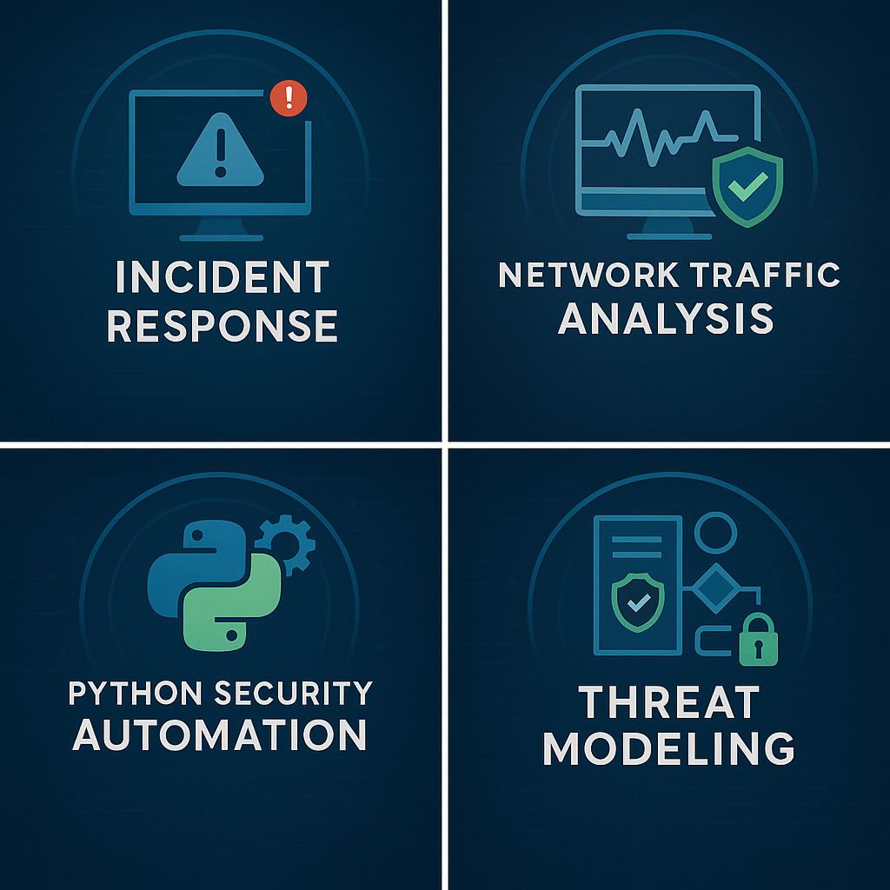

<p align="center">
  
</p>
# 🌐 Network Traffic Analysis: HTTP/HTTPS Investigation

## Overview  
Performed packet analysis using Wireshark to investigate suspicious outbound HTTPS traffic. Identified potential command-and-control (C2) activity based on beaconing patterns and malicious indicators.

---

## 🚨 Scenario  
**Alert:** Repetitive outbound connections every 45 seconds  
**Destination:** Unknown domain `updates-checker-app.net`  
**Indicators:**
- Suspicious user-agent: `malwareCrawler`  
- Newly registered domain  
- TLS handshake anomalies  

---

## 🛠 Tools Used  
- Wireshark  
- WHOIS  
- AbuseIPDB  
- TLS Handshake Analysis  
- DNS Inspection  

---

## 🔍 Investigation Steps

### **1. Filtered HTTP/HTTPS traffic**
```
tcp.port == 80 || tcp.port == 443
```
Identified repeated beaconing patterns related to a single malicious host.

---

### **2. Inspected HTTP Headers**
Found a malicious user-agent:  
`malwareCrawler 1.0`  
and suspicious GET requests to `/api/v1/status`.

---

### **3. Domain/IP Reputation Check**
- Domain was **newly registered**
- Hosted on **suspicious VPS provider**
- Associated with **known malware C2 campaigns**

---

### **4. TLS Handshake Analysis**
Identified:
- Self-signed certificate  
- Invalid issuer  
- Non-standard cipher suite  
Indicating possible encrypted malicious traffic.

---

## ✔ Final Outcome  
Identified likely C2 beaconing behavior.  
**Actions Taken:**
- Blocked domain  
- Disconnected infected host  
- Removed malicious components  
- Added detection rule for beaconing intervals  

