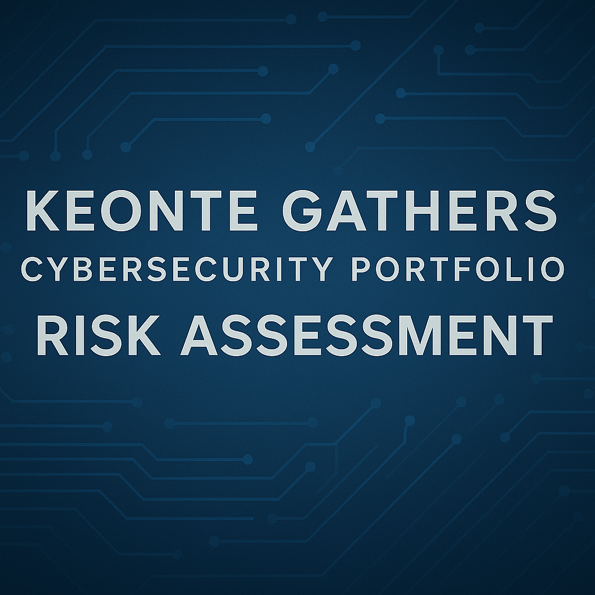

  

🧰 Skills Applied

Security auditing

NIST CSF & NIST 800-53 control review

Gap identification and prioritization

Risk scoring and risk matrix development

Compliance alignment

Policy & control evaluation

Remediation planning and recommendations
🛠 Frameworks & Tools Used

NIST Cybersecurity Framework (CSF)

NIST 800-53 Rev5

Risk Matrix (likelihood × impact)

Control checklists

Asset categorization

Security configuration reviews (MFA, logging, access control)
✔ Summary of Findings

Identified several high-risk gaps, including:

No Multi-Factor Authentication (MFA)

Insufficient logging and monitoring

Uncontrolled USB device access

Weak password policies

Missing incident response documentation

Prioritized findings by likelihood and impact

Created a remediation roadmap with immediate, short-term, and long-term fixes

Demonstrated ability to translate technical risks into business-level recommendations
📌 Compliance Areas Reviewed

Access Control (AC)

Audit & Accountability (AU)

System & Information Integrity (SI)

Identification & Authentication (IA)

Configuration Management (CM)
# 📊 Security Audit & Risk Assessment (NIST-Based)

## Overview  
Conducted a structured internal security audit using NIST CSF and NIST 800-53 controls. Performed a full risk assessment, identified critical security gaps, and developed a prioritized remediation roadmap to strengthen organizational security posture.

---

## 🛠 Tools & Frameworks Used  
- NIST 800-53  
- NIST Cybersecurity Framework (CSF)  
- Risk Matrix  
- Controls & Compliance Checklist  
- PASTA Threat Insights  
- Documentation & Reporting Tools  

---

## 🔍 Audit Scope  
Assessed the following security domains:

- Authentication & Access Control  
- Logging & Monitoring  
- Patch & Vulnerability Management  
- Data Protection & Encryption  
- Incident Response  
- USB & Removable Media Controls  
- Physical & Administrative Controls  

---

## 🧪 Key Findings

### 🔴 **High-Risk Issues**
- No MFA on admin accounts  
- Inconsistent logging across critical servers  
- Weak password rotation policies  
- Unrestricted USB mass storage usage  

### 🟠 **Medium-Risk Issues**
- Partial encryption of internal network traffic  
- Outdated browser versions  
- Lack of incident response tabletop exercises  

### 🟢 **Low-Risk Issues**
- Missing documentation  
- Minor misconfigurations  

---

## 📘 Methodology  
Your assessment followed:

### **1. Controls Review**  
Completed the NIST-based Compliance & Controls Checklist.

### **2. Threat Identification (PASTA Stage 4)**  
Used PASTA threat modeling inputs to identify relevant attack vectors.

### **3. Risk Scoring**  
Mapped risks by:
- Likelihood  
- Impact  
- Exposure  
- Mitigation difficulty  

### **4. Reporting**  
Created a formal Risk Assessment Report summarizing:
- Findings  
- Evidence  
- Risk scoring  
- Recommendations  

---

## ✔ Remediation Recommendations

### 🔴 **High Priority**
- Enforce MFA  
- Centralize SIEM logging  
- Restrict USB usage and enable device control  
- Strengthen password policy & rotation  

### 🟠 **Medium Priority**
- Encrypt internal data flows  
- Improve patch cadence  
- Conduct quarterly IR exercises  

### 🟢 **Low Priority**
- Update documentation  
- Standardize security onboarding processes  

---

## 📌 Final Outcome  
Delivered a complete audit package including:
- Controls checklist  
