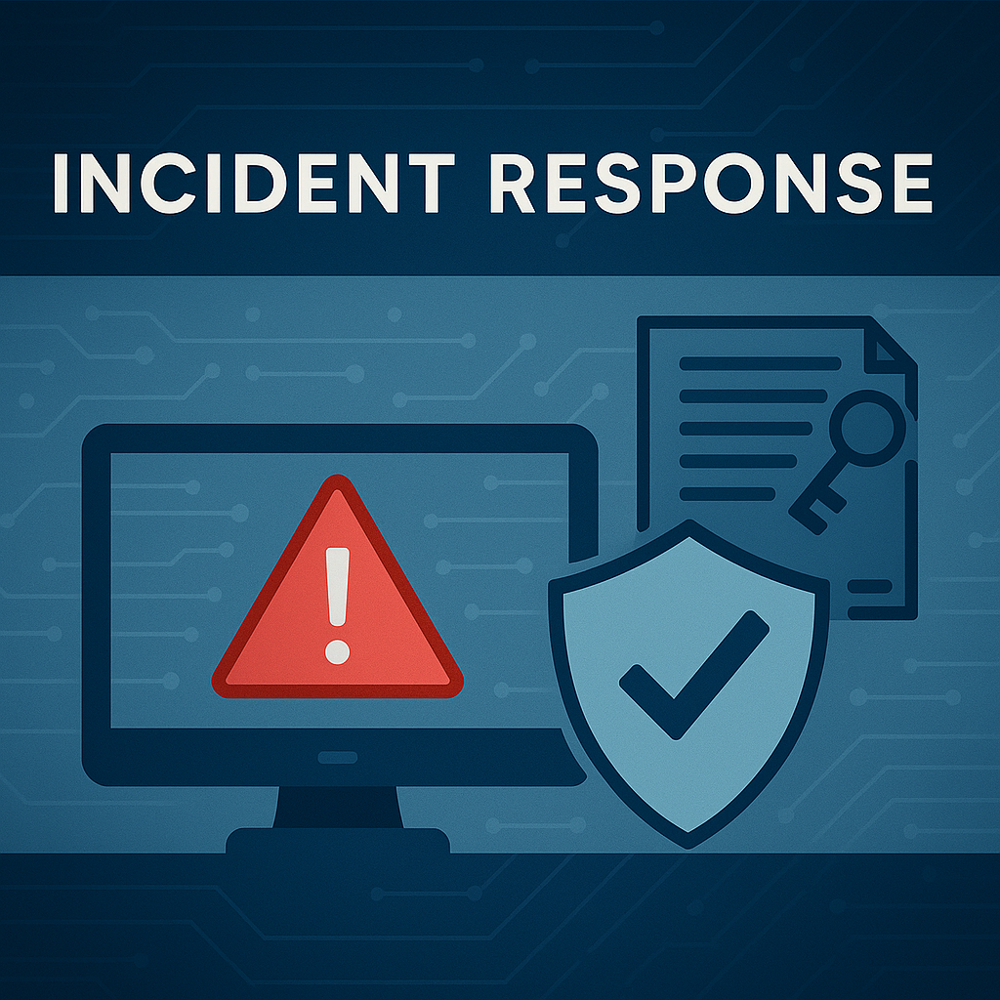

<p align="center">
  
</p>
# 🛡️ Incident Response: Suspicious Login & Brute-Force Attempt
## 🧰 Skills Applied
- Log analysis (authentication events)  
- Brute-force detection  
- IP reputation checks  
- User identity verification  
- Containment recommendations  
- Incident documentation  
- MITRE ATT&CK mapping  
🛠 Tools Used

Splunk

CyberChef

AbuseIPDB / WHOIS lookup

Windows Event Logs

Security Onion (optional)
✔ Summary of Findings

Detected repeated failed login attempts followed by 1 successful login

Identified suspicious IP addresses with poor reputation

Found evidence of brute-force behavior (multiple failed attempts with short intervals)

Confirmed login did not match the user’s normal location

Recommended password reset, MFA enforcement, session termination, and IP blocking
## Overview  
Investigated a suspicious sequence of failed login attempts followed by a successful login, indicating a potential brute-force or credential compromise attack. Used Splunk to analyze authentication logs and executed containment procedures.

---

## 🔍 Scenario  
SIEM alerts flagged:
- 17 failed login attempts in 4 minutes  
- 1 successful login  
- Impossible travel activity  
- Foreign IP associated with brute-force attempts  

---

## 🛠️ Tools Used  
- Splunk  
- Linux Authentication Logs  
- WHOIS  
- GeoIP  
- OSINT lookups  

---

## 🔬 Investigation Summary

### **1. Log Analysis in Splunk**
```
index=auth sourcetype=linux_secure user="example_user" 
| stats count by src_ip, action, _time
```
Findings:  
- Multiple failed attempts from Eastern Europe  
- Successful login from unrelated U.S. IP  
- Behavior matched brute-force testing  

---

### **2. IP Reputation Check**
- Foreign IP listed for repeated brute-force activity  
- U.S. IP did not belong to the user  
- Both flagged as suspicious/botnet indicators  

---

### **3. User Verification**
User confirmed:
- Not traveling  
- Did not log in  
- Did not initiate password resets  

---

### **4. Containment**
- Forced password reset  
- Disabled affected account  
- Blocked IPs on firewall  
- Increased monitoring  

---

## ✔ Final Outcome  
Attack was disrupted before lateral movement occurred. No data exposure or privilege escalation detected. Enhanced rules for login-based alerts.

